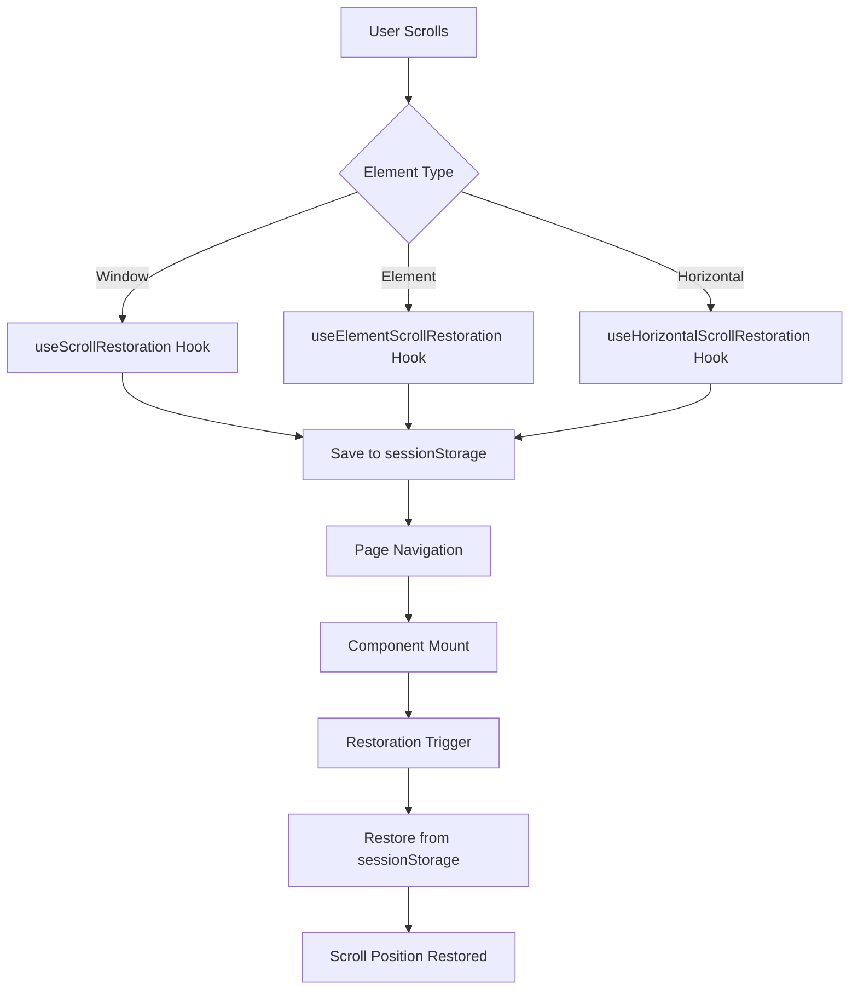

# Scroll Restoration Architecture

This document provides a comprehensive overview of the scroll restoration system implemented in the letsstream application.

## Overview

The scroll restoration system uses a multi-hook approach to handle different types of scroll restoration needs across the application. The system is designed to be reliable, performant, and consistent across all pages.

## Hook Descriptions

### useScrollRestoration
- **Purpose**: Window-level vertical scroll restoration
- **Usage**: Most pages that need to restore window scroll position
- **Storage Key Format**: `scroll-positions-{pathname}`
- **Features**: Debounced saving, restoration with timeout fallback, hydration-aware

### useElementScrollRestoration
- **Purpose**: Element-level vertical scroll restoration (e.g., ScrollArea components)
- **Usage**: Episode sidebar, custom scroll containers
- **Storage Key Format**: Custom key per component
- **Features**: Element availability polling, restoration with timeout fallback

### useHorizontalScrollRestoration
- **Purpose**: Horizontal scroll restoration for ContentRow components
- **Usage**: Horizontal content rows in Index, MovieDetails, TVDetails pages
- **Storage Key Format**: `scroll-horizontal-{pathname}-{sanitizedTitle}` or `scroll-horizontal-{pathname}-{sanitizedTitle}-{rowId}`
- **Features**: Manual save trigger from React event handlers, restoration with timeout fallback

### usePageStatePersistence
- **Purpose**: Complex state persistence (pagination, filters, accumulated data)
- **Usage**: List pages like Movies, TVShows, Search
- **Storage Key Format**: Custom key per page
- **Features**: Quota error handling, automatic cleanup, filter validation

## Global Components

### AnalyticsWrapper
- Provides redundancy for scroll restoration
- Saves scroll position on navigation using same key format as `useScrollRestoration`
- Acts as backup if primary restoration hooks fail

### routes.tsx
- Controls browser scroll restoration behavior via `VITE_SCROLL_RESTORATION_MANUAL` environment variable
- Sets `window.history.scrollRestoration = 'manual'` when enabled

## Page Strategies

### List Pages (Movies, TVShows, Search, Trending)
- Combination of `useScrollRestoration` + `usePageStatePersistence`
- Hydration tracking to ensure content is loaded before restoration
- Filter validation to prevent state mismatches
- Tab-specific scroll position tracking

### Detail Pages (MovieDetails, TVDetails)
- Tab-specific scroll keys (e.g., `scroll-movie-details-{tab}`)
- Dynamic content hydration coordination
- Tab-specific restoration timing

### Player Page
- Media-type specific keys (e.g., `scroll-player-movie-{id}`, `scroll-player-tv-{id}-{season}`)
- Episode sidebar element scroll restoration
- Layout consideration for video player positioning

### Profile/WatchHistory
- Tab-specific scroll restoration
- Lazy-loaded tab coordination
- Infinite scroll preservation

### Index Page
- Multiple ContentRow horizontal restoration
- Phased content loading coordination
- Hydration based on primary content visibility

## Data Flow

## Best Practices

1. **Always use hydration tracking** for pages with async data to ensure content is loaded before restoration
2. **Use unique storage keys** for tab-specific or context-specific restoration
3. **Enable restoration only after content is loaded** to prevent jumps during loading
4. **Clean up event listeners and timeouts** in useEffect return functions
5. **Handle sessionStorage errors gracefully** to support incognito mode and quota limits
6. **Validate persisted state** against current URL parameters to prevent filter mismatches

## Configuration

The system is controlled by the `VITE_SCROLL_RESTORATION_MANUAL` environment variable:
- `true`: Enables custom scroll restoration implementation
- `false`: Falls back to browser default scroll restoration

## Error Handling

The system gracefully handles various error conditions:
- **Quota Exceeded**: Automatic cleanup of old entries
- **Privacy Mode**: Fallback to scroll-to-top behavior
- **Slow Network**: Timeout fallbacks to prevent being stuck at top
- **Invalid State**: Validation to ensure filter/state consistency